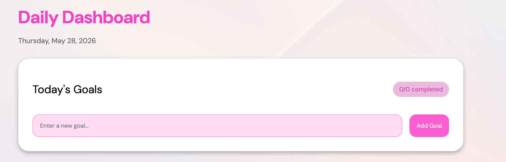
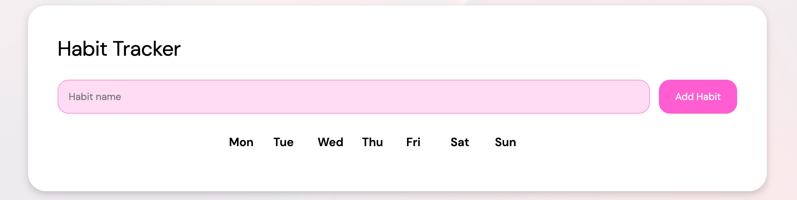
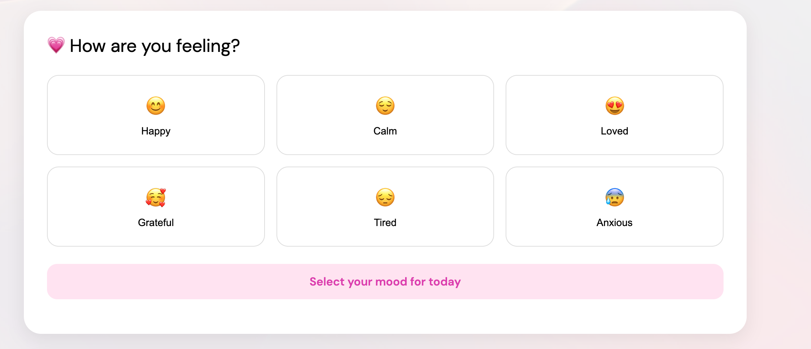
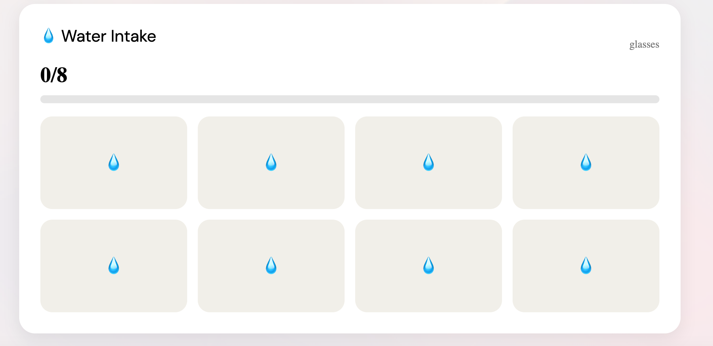
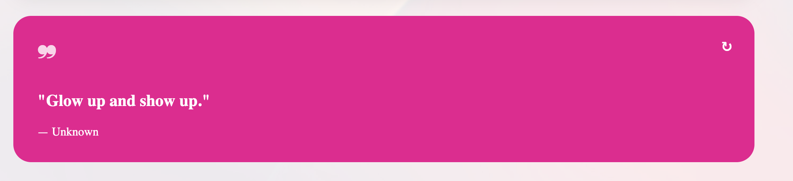

# That Girl Dashboard ✨

A productivity and self-care dashboard designed to help users stay organized, track healthy habits, and build positive daily routines.

## Features

- Daily Goals Tracker
- Mood Tracker
- Water Intake Tracker
- Inspirational Quote Generator
- Dynamic Date Display
- Habit Tracker
- Responsive Design

## Technologies Used

- HTML5
- CSS3
- JavaScript (ES6)
- Git & GitHub

## Project Preview

### Daily Goals

### Habits

### Mood Tracker

### Water Tracker

### Quote Generator

## How It Works

### Daily Goals

Users can add goals, mark them complete, and track their progress throughout the day.

### Habit Tracker

Users can create habits and track completion for each day of the week.

### Mood Tracker

Users can select their current mood and receive visual feedback.

### Water Tracker

Users can track their daily water intake by clicking water buttons.

### Quote Generator

Users can generate a new motivational quote with the click of a button.

## Future Improvements

- Save user data with Local Storage
- Add weekly analytics
- Add dark mode
- Add user authentication

## Author

Designed & Developed by **Imani Bennett** ✨

GitHub: https://github.com/imaniariyana
